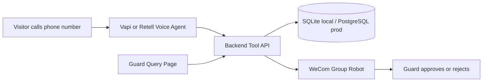

# AI Voice Visitor Registration

Production-style MVP for an industrial park entrance: a Chinese voice agent collects visitor vehicle info, calls a backend tool API, stores the record, and sends a WeCom group robot message for the guard.



## Demo Flow

```text
AI: 您好，这里是园区访客登记。麻烦说下车牌号、找哪家公司、来做什么事儿？
User: 沪，A，一二三四五，来蓝色鲸鱼送货。
AI: 收到，手机号麻烦一位一位说一下。
User: 一三三，八六六，五二五，一零。
AI: 我确认一下，手机号是 13386652510，对吗？
User: 对。
AI: 好的，已通知门卫，请稍等放行。
```

The final demo uses explicit digit-by-digit phone collection for reliability. The backend still supports `caller_number` fallback, but it is not the default demo path.

## Quick Start

```powershell
npm.cmd install
copy .env.example .env
npx.cmd prisma generate
npx.cmd prisma migrate dev
npm.cmd run seed
npm.cmd run dev
```

Check health:

```powershell
curl.exe http://127.0.0.1:3000/health
```

## Environment

```text
PORT=3000
DATABASE_URL="file:./dev.db"
WECOM_WEBHOOK_URL=""
PUBLIC_BASE_URL="http://localhost:3000"
VOICE_PROVIDER="vapi"
WEBHOOK_SECRET=""
NODE_ENV="development"
```

Never commit `.env`, Vapi keys, WeCom webhooks, phone numbers, or production database credentials.

## Main Endpoints

- `GET /health`
- `POST /tools/submit-visitor`
- `POST /tools/validate-phone`
- `POST /tools/lookup-returning-visitor`
- `POST /webhooks/call-events`
- `GET /visitors`
- `GET /guard`
- `POST /guard/query`
- `GET /guard/visitors/:id/approve?token=...`
- `GET /guard/visitors/:id/reject?token=...`

## Vapi Setup

Use [docs/voice-agent-prompt.md](docs/voice-agent-prompt.md) for the prompt and schemas.

When the tunnel URL changes:

```powershell
$env:VAPI_API_KEY="paste_private_key_here"
$env:VAPI_TOOL_ID="f478648e-5537-4b11-a5f5-6330b45c8017"
$env:VAPI_ASSISTANT_ID="7835273d-ce47-4cb4-b7e9-ad43057b0183"
$env:PUBLIC_BASE_URL="https://your-current-tunnel.trycloudflare.com"
npm.cmd run vapi:revert-phone-flow
```

This sets the `submitVisitor` tool URL, keeps `phone` required, and updates the assistant webhook to `/webhooks/call-events`.

## WeCom Setup

Create an Enterprise WeChat group robot and set `WECOM_WEBHOOK_URL` only in local or deployment environment variables. If it is missing locally, the backend mock-sends successfully.

WeCom messages include:

- plate number, company, phone, reason, entry time
- approve/reject links when `PUBLIC_BASE_URL` is set
- approval page updates status to `approved`
- rejection page updates status to `rejected`

Gate control is currently mocked in `src/services/gate-control.ts`; production can replace it with a Hikvision gate or barrier controller API.

## Bonus Features

- Returning visitor lookup by `phone`, `plate_number`, or `caller_number`
- Guard analytics page at `/guard`
- Deterministic Chinese query parser for today/week/month counts, company counts, phone/plate visit counts, and busiest hour
- Idempotency by `call_id` to avoid duplicate WeCom pushes
- Phone and plate normalization for common Chinese ASR errors

## Test

```powershell
npm.cmd run test
npm.cmd run build
```

See [docs/test-report.md](docs/test-report.md) for final demo notes and acceptance checklist.

## Production Path

Move from SQLite to PostgreSQL, add auth around `/guard` and `/visitors`, add webhook signatures, persist Cloudflare/Vapi URLs in deployment config, add observability and rate limits, and replace mock gate control with the real parking barrier integration.
