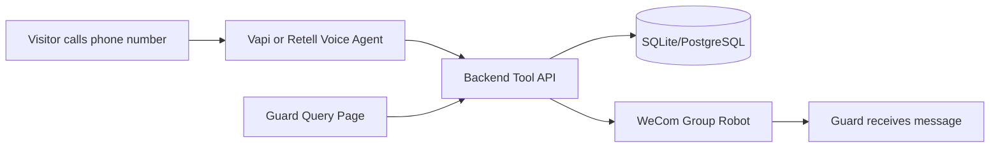

# AI Voice Visitor Registration MVP

Production-oriented MVP for an industrial park voice visitor registration flow. A Vapi or Retell voice agent collects visitor details in Chinese, calls this backend tool API, the backend validates and stores the record, then pushes a WeCom group robot markdown notification.



## Features

- Fastify + TypeScript + Prisma + Zod-style validation helpers
- Direct JSON, Vapi tool-call, and Retell custom-function adapters
- Visitor submission with normalization, confidence checks, idempotency by `call_id`, and timing logs
- WeCom markdown notification with 5s timeout, 2 attempts, and local mock-sent mode
- Returning visitor lookup from the last 30 days
- Minimal `/guard` page and deterministic `/guard/query` Chinese analytics parser
- SQLite local development with a documented PostgreSQL upgrade path

## Quick Start

```bash
npm install
cp .env.example .env
npx prisma generate
npx prisma migrate dev
npm run seed
npm run dev
```

Check the service:

```bash
curl http://localhost:3000/health
```

Submit a visitor:

```bash
curl -X POST http://localhost:3000/tools/submit-visitor \
  -H "Content-Type: application/json" \
  -d '{
    "plate_number":"沪A12345",
    "target_company":"蓝色鲸鱼",
    "phone":"13812341234",
    "visit_reason":"送货",
    "caller_number":"+13145550000",
    "call_id":"demo-call-001"
  }'
```

Repeat the same `call_id` to verify idempotency. Open `http://localhost:3000/guard` for the guard query page.

## Environment

```bash
PORT=3000
DATABASE_URL="file:./dev.db"
WECOM_WEBHOOK_URL=""
PUBLIC_BASE_URL="http://localhost:3000"
VOICE_PROVIDER="vapi"
WEBHOOK_SECRET=""
NODE_ENV="development"
```

`WECOM_WEBHOOK_URL` is optional locally. If it is empty, submissions still succeed with `status: "mock-sent"`.

## API

- `GET /health`
- `POST /tools/submit-visitor`
- `POST /tools/lookup-returning-visitor`
- `POST /webhooks/call-events`
- `GET /visitors?limit=20&plate_number=&phone=&target_company=&from=&to=`
- `GET /guard`
- `POST /guard/query`

## Voice Agent Setup

Use `docs/voice-agent-prompt.md` for the Chinese system prompt, first message, tool schemas, and examples.

Vapi tool URLs:

- `${PUBLIC_BASE_URL}/tools/submit-visitor`
- `${PUBLIC_BASE_URL}/tools/lookup-returning-visitor`

Retell custom function endpoints:

- `${PUBLIC_BASE_URL}/tools/submit-visitor`
- `${PUBLIC_BASE_URL}/tools/lookup-returning-visitor`

Call events webhook:

- `${PUBLIC_BASE_URL}/webhooks/call-events`

## WeCom Setup

Create an Enterprise WeChat group robot and set `WECOM_WEBHOOK_URL` in the runtime environment. The app never logs the full webhook URL. Notification content is markdown and includes plate, company, phone, reason, entry time, and pending confirmation status.

## Testing

```bash
npm run test
npm run build
```

Tests cover normalization, submission in mock WeCom mode, idempotency, returning visitor lookup, and guard query parsing.

## Known Limitations

- The MVP uses deterministic Chinese keyword parsing, not an LLM, for `/guard/query`.
- `schema.prisma` uses SQLite for the acceptance flow. For Neon/PostgreSQL production, switch the datasource provider to `postgresql`, run a production migration, and keep the same app code.
- There is no auth on debug endpoints yet. Add auth or network controls before exposing `/visitors` and `/guard` publicly.

## Production Upgrade Path

Add webhook signature verification, admin auth, richer observability, production PostgreSQL migrations, rate limits, and a small admin UI for company aliases. See `docs/deployment.md` for Render/Railway/Fly/Vercel notes.
